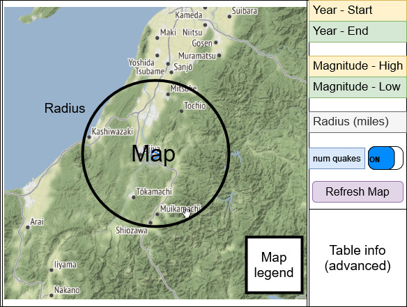

# planning-spec-example
Example of a planning spec for HCI 584 based on sketch.md

### General description of the project (2 pts)
- start with your sketch and enhance it.
- The actual description (summary) should be about a half page (3 - 5 paragraphs) and initially introduce your project so that a non-techie (like your boss) can get the gist of the project. 
- Also:
    - Mention, if applicable, what external mechanisms (major packages, API, email, twitter, etc.) you will use
    - What GUI would it ideally use? Could it minimally run with a command line interface (CLI).
    - Could this also have a "remote" control, e.g. offer some form of API?

Example:
- This will show a user the current and past quake activity around their current location. For example students in Chicago would learn about the 5.5 magnitude 1968 quake.
- App shows a map with the most severe historical quake activity at a user given location (which could be their current location by default) and within a user given radius. 
- The map will show something like a google map of the area, quake locations are shown as point markers sized by the magnitude (also show a size -> magnitude) legend. 
- The user should be able to filter/refine this by setting ranges for date and magnitude and/or the overall number. 
- By default  the X most severe quakes (up to 100) from 1900 - present would be shown.
- External:
    - Scrape data from USGS: https://earthquake.usgs.gov/fdsnws/event/1/ 
    - Google Map type background map from Leaflet (via Folium HTML https://python-visualization.github.io/folium/quickstart.html 
    - Browser-based geolocation via geopy to have the app start at the user's current location (coordinates)
- GUI: Web app (ideally mobile) using Flask but I would want to start with a jupyter notebook as I know that Folium works well with it. Later I would use Folium with Flask: https://python-visualization.github.io/folium/flask.html 
- Possible enhancements: 
    - Each marker could visualize additional quake properties, like depth. 
    - Users could request a statistics table and plot (graph, non-map!) of these quakes.
    - Also provide an API which would receive these user set parameters (query parameters or JSON) and return a map/table/plot. That would allow a cleaner client architecture and open the data part up to other, similar apps
    - Make this into a mobile app
    - have user choose unit for radius (km vs miles)
    - have a size factor slider to make all markers proportionally smaller/bigger
    - toggle to show data and magnitude as bubble text next to each marker, maybe only on mouse over
    - add a zoom back to radius in case the user got lost on the map
    
### Task Vignettes (User activity "flow") (4 pts)
- For each major task write a short vignette that illustrates it. Again, it's OK to just assume a lot of things ... like that your user really needs to perform a task (although you don't actually know that) or that the task will be for now performed magically (to be solved later).
- The order of your task should make sense. It's OK to bundle several tasks into a vignette if they are naturally related 
- I expect 1-2 paragraphs per vignette
- After each vignette, you should list technical details as bullet points. This includes anything that the user may not be aware of but that could be potentially important for the implementation.

- If you can, add crude design mockups or wire frames (hand drawn or simple power point diagrams) that capture the user interaction. You can re-use mockups created for the sketches. However, these are __not a must!__  For now, just articulate what actions happen and what data flows where. 
- You don't have to design a GUI for the spec, although for many that's a natural way to articulate the activity. 
You're welcome to use it as a "graphical language". 
- Just know that for your version 1, you may actually end up implementing the data flow as a command line interface!

Example:

- Task 1: Filter by date and magnitude ranges
    - location will be given automatically
    - User configurable fields:
         - date range: default 1900 to current, only uses years!
         - magnitude range: defaults to 7 to 9.5
         - radius: 10 miles

- Task 1 user activity:
    - user starts app, fetches and shows quakes as per defaults
    - user enters start (1950) and end (2022) years  (Validate GUI: start < end!)
    - user enters magnitude high (9.5) and low (7.2) (Validate: high > low)
    - user enters radius: 50 miles
    - user leaves num_quakes toggle off, num_quakes is greyed out
    - user hits Refresh Map, which connects to the USGS (show spinner while processing) and changes the map markers and radius accordingly and updates the map legend to show which size corresponds

- Task 2: Filter by date range and X largest magnitude quakes
    - location will be given automatically
    - User configurable fields:
         - date range: default 1900 to current, only uses years!
         - radius: 10 miles
         - show number of X largest quakes number field (10), initally toggled off

- Task 2 user activity:
    - user starts app, fetches and shows quakes as per defaults
    - user enters start (1950) and end (2022) years  (Validate GUI: start < end!)
    - skips magnitude selection
    - user enters radius: 50 miles
    - user switched num_quakes toggle oon, num_quakes is now active (default: 10 largest quakes) and magnitude is inactive
    - user enters num_quakes: 25
    - user hits Refresh Map, which connects to the USGS (show spinner while processing) and changes the map markers and radius accordingly and updates the map legend to show which size corresponds

- Diagram:

### Technical "flow" (3 pts)
- Now that you've described the user tasks and actions, you should look at the flow from a more technical side. Strictly speaking this goes deeper that a high-levnum_quakes toggle off, num_quakes is greyed out
- user hits Refresh Map, which connects to the USGS (show spinner while processing) and changes the map markers accordingly and updates the map legend to show which size/colorel spec would typically require, but I think it's a valuable exercise to go through before beginning to code!  
- I realize that this may be tricky for you ... as usual, just do your best, I will reward demonstrated effort. 

- I find it best to think in terms of data flow (i.e. input/output) but if you know OOP and plan to use it, you might do a bit of early class design here instead. (There will be a lecture on OOP soon)
- Describe the overall “flow” of data, either with words (see example) and/or by creating a simple diagram on paper, with PowerPoint or with an online drawing app such as https://app.diagrams.net/ or https://draw.io Or  do it on paper and hand in a snapshot of it.
 
- Jot down what blocks you think you’ll need and maybe try to group them into larger blocks.
- Name the blocks by what they do (this will help with names for classes/functions/modules later!)
- Use arrows to show which blocks need to generate/receive/exchange data (flow)
- Separately jot down the types of the data in that flow (list, dictionary, array, compounds, classes?)
- Note which blocks involve user interaction and of what kind (input? Output?)

Example:

Data structures: 
    - pandas dataframe, each containing data about each quake (date, lat/long location, magnitude) that's been scarped from the USGS
    - a dict or object that stores all the current values for all application form fields: data range, magnitude range, radius, num_quakes, toggle, etc. 
    - default values for these could be hard coded or read from a config.txt file
    - dict/object with any other values the application needs, that are NOT user configurable, e.g. the current location, which is provided at startup from the geolocation function, a scale factor for the markers, geometry/color or the markers, etc.

Core functions:
- def get_location():
    - uses geolocation to approximate current browser geolocation 
    - not sure yet if/how user concent is needed?
    - returns geolocation (lat/long) or error string (hardcode Chicago as backup location on fail)

- def get_quake_data(date_range, magnitude_range, number_of_largest_quakes, radius):
    - scrapes data from the USGS according to arguments
    - if number_of_largest_quakes is None, magnitude range is used
    - should still be limited to ~100 quakes to ensure a responsive map (in which case they should be sorted by magnitude!)
    - returns a pandas dataframe or error string

- def draw_map(folium_map, dataframe, config_dict):
    - draws markers from the dataframe into a folium map
    - config_dict has stuff like scale factor, marker geometry and color, etc.
    - needs to also update the map legend

Program flow:
- Flask app main page creates the GUI, gets geolocation and renders the folium map for this location with current GUI defaults using the dataframe
- (GUI could be vanilla Javascript or maybe Bootstrap ...)
- changes in GUI fields are collected in a HTML form and sent back to the server
- scrapes a new dataframe according to user values, clears folium map and re-draws it from new dataframe

### Final (self) assessment (1 pt)
- After working through the spec, what was the biggest most unexpected change to had to make from your sketch?
- How confident do you feel that you can implement the spec as it's written right now?
- What is the biggest potential problem that you NEED to solve (or you’ll fail)?
- What parts are you least familiar with and might need my help?

Example:
- Realized that I had to be more precise with what needs to be in the core prototype and what are enhancements for later
- I actually should not go for a Flask app right away, but instead implement anything outside the GUI in a jupyer notebook first and simulate the GUI user input by hardcoding first
- I've done a similar Flask app before and have also used Bootstrap as GUI 
- I've not tried the geolocation module
- Biggest anticipated problem: nicely dealing with the time needed to scrape new data, during which teh app is likely to freeze up(?) Should add a spinner.
